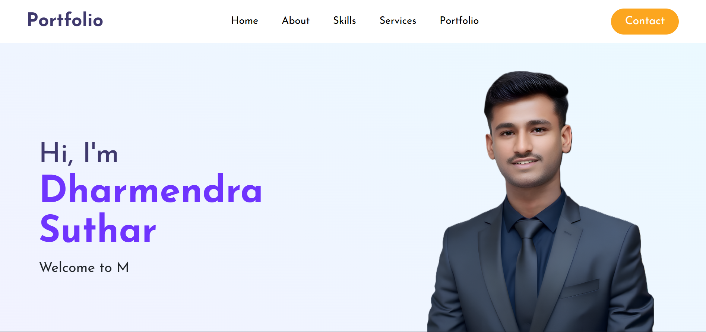
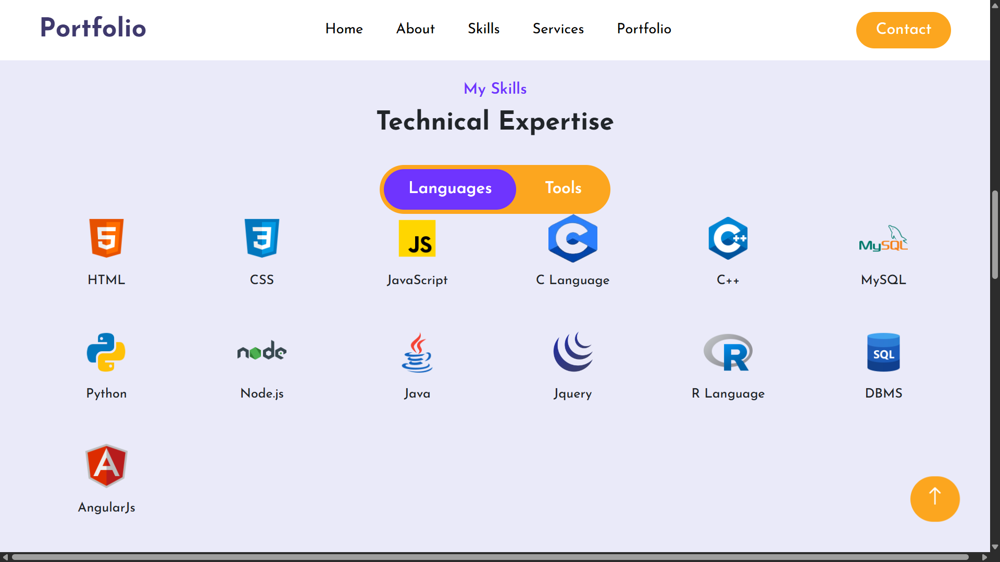

# 🌐 Personal Portfolio Website

🔗 **Live Website:** [Click Here](https://dharmendrasuthar.github.io/Portfolio-website/)  
📂 **Repository:** [GitHub Repo](https://github.com/dharmendrasuthar/Portfolio-website)

### 🏠 Home Page


## 📖 About the Project

This is my **personal portfolio website** created to showcase my skills, projects, and services as a **Frontend Developer**.  
The site is fully responsive, clean, and designed for a professional online presence.

---

## 🧑‍💻 About Me

Hi, I’m **Dharmendra Suthar** 👋  
A passionate **Frontend Developer** skilled in HTML, CSS, JavaScript, and other technologies. I enjoy building modern, user-friendly, and responsive websites.  

---
### 💼 About Page


## 🛠️ Tech Stack

- **Languages:** HTML, CSS, JavaScript, C, C++, Python, Java, R  
- **Frameworks & Tools:** Node.js, AngularJS, jQuery  
- **Database:** MySQL, DBMS  
- **Other Tools:** Git & GitHub, Canva, Excel, VS Code, Debugging  

---


### 📬 Skills Page


## 📂 Project Structure

```bash
Portfolio-website/
│
├── index.html        # Home Page
├── about.html        # About Me
├── skills.html       # Skills
├── services.html     # Services Offered
├── portfolio.html    # Projects Showcase
├── contact.html      # Contact Section
│
├── assets/
│   ├── css/          # Stylesheets
│   ├── js/           # Scripts
│   └── images/       # Images
│
└── README.md
